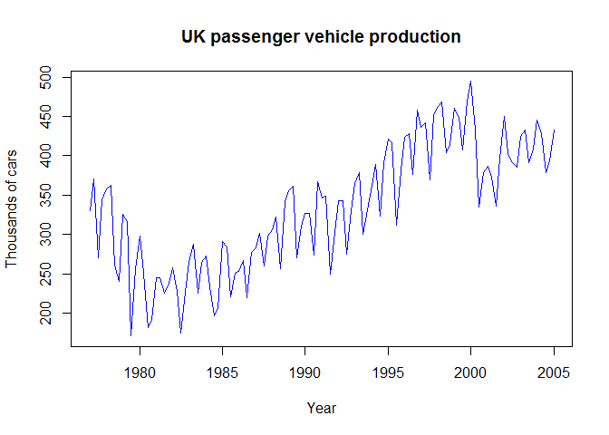
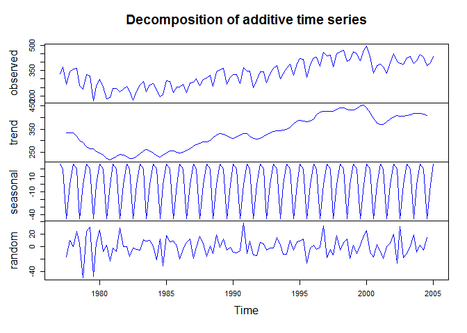
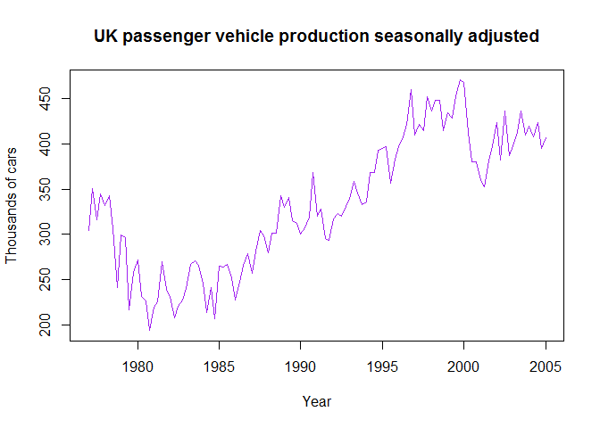
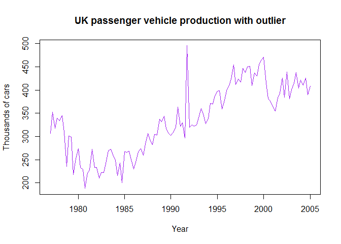
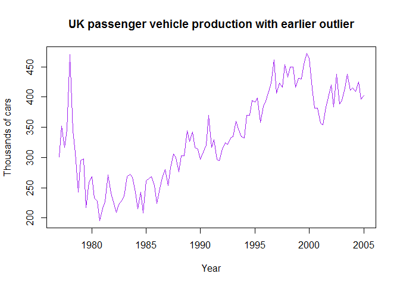
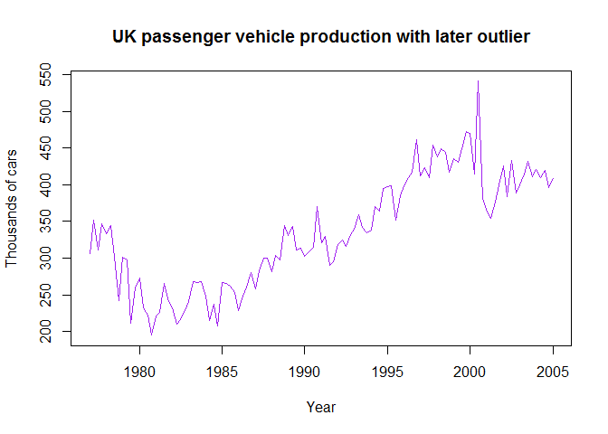
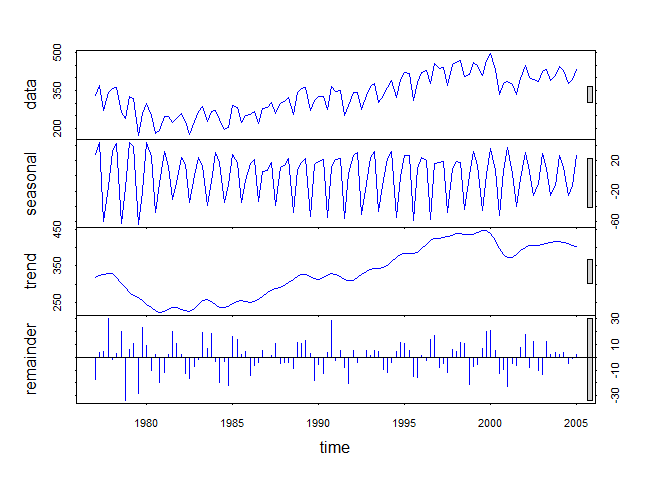

Overview
--------

This project demostrates working with timeseries data in R. The data for
this project is found in the "expsmooth" library. It contains UK
passenger vehicel prodction between the years 1977 and 2005.

The source of the data is: yndman, R.J., Koehler, A.B., Ord, J.K., and
Snyder, R.D., (2008) Forecasting with exponential smoothing: the state
space approach, Springer

Load ffp and it's dependencies.

      library(fpp) 

    ## Loading required package: forecast

    ## Loading required package: zoo

    ## 
    ## Attaching package: 'zoo'

    ## The following objects are masked from 'package:base':
    ## 
    ##     as.Date, as.Date.numeric

    ## Loading required package: timeDate

    ## This is forecast 7.3

    ## Loading required package: fma

    ## Loading required package: tseries

    ## Loading required package: expsmooth

    ## Loading required package: lmtest

Load in ukcars dataset which is included in expsmooth library, a library
fpp is dependent on.

      data(ukcars)

Print out str and first few row of ukcars.

      str(ukcars)

    ##  Time-Series [1:113] from 1977 to 2005: 330 371 271 344 358 ...

      head(ukcars)

    ## [1] 330.371 371.051 270.670 343.880 358.491 362.822

Part A
------

Plot ukcars time-series.

      plot(ukcars,col="blue",main="UK passenger vehicle production",ylab="Thousands of cars",xlab="Year")

It's difficult from the plot to identify any seasonal trends. There is
clear a downward trend from the starting year, 1977, to around 1981, at
which the trend changes direction. This trends continues tunil around
the year 2000, at which it changes direction towards a downward trend.
There are clearly season dips in the series, but the prevailing upward
trend makes it difficult to identify.

Part B
------

      fitcars <- decompose(ukcars)
      plot(fitcars,col="blue")

Using a classical decomposition of additive method, we can see larger
trend-cycle and seasonal indices more easily. For trends, we see a plot
that is like the plot from part A, but smoothed out. We see a turn down
at the start of the data, 1977, a change up in 1980, another slight
change down in the late 90s, which levels off in the early 2000s.

For season indices, the seasonal plot indicates a yearly cycle pattern.
The seasonal cycle fluctuates between 20 and -50.

Part C
------

Yes, there are clearly small seasonal turns in direction identifiable in
plot from part A. Although, it's difficult to identify cycle and
indices.

Part D
------

Compute and plot the seasonally adjusted data.

    fitcarsseason <- seasadj(fitcars)
    plot(fitcarsseason, col="purple",main="UK passenger vehicle production seasonally adjusted",ylab="Thousands of cars",xlab="Year")

Part E
------

      #Get length of vector
      length(fitcarsseason)

    ## [1] 113

      #Change value near the middle of series to 500
      originalval <- ukcars[60]
      ukcars[60] <- 500
      
      #Recompute seasonal adjustment and plot
      fitcarsseason <- seasadj(decompose(ukcars))
      plot(fitcarsseason, col="purple",main="UK passenger vehicle production with outlier",ylab="Thousands of cars",xlab="Year")

      #change it back to the original value
      ukcars[60] <- originalval
      fitcarsseason <- seasadj(decompose(ukcars))

The outliers change the plot dramatically. Even with smoothing,
decomposition, and seasonal adjustment, the existent of the outliers
causes a significant change in direction of the trend.

Part F
------

Update value in the beginning

      ukcars.partf.begin <- ukcars
      ukcars.partf.begin[5] <- 500
      plot(seasadj(decompose(ukcars.partf.begin)),col="purple",main="UK passenger vehicle production with earlier outlier",ylab="Thousands of cars",xlab="Year")

Update value towards the end of the series

      ukcars.partf.end <- ukcars
      ukcars.partf.end[95] <- 500
      plot(seasadj(decompose(ukcars.partf.end)), col="purple",main="UK passenger vehicle production with later outlier",ylab="Thousands of cars",xlab="Year")

It does affect the seasonally adjusted plot if the outlier appears at
the beginning or end vs the middle.

Part G
------

Plot Seasonal and Trend decomposition using Loess for ukcars data.

      ukcars.stl <- stl(ukcars,s.window=5)
      plot(ukcars.stl,col="blue")

